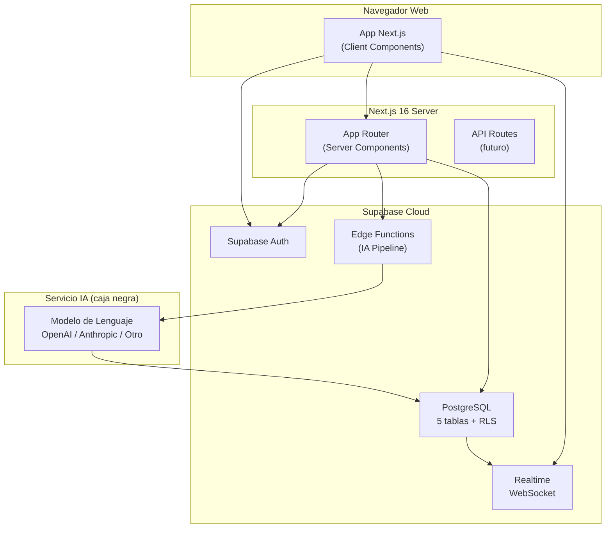
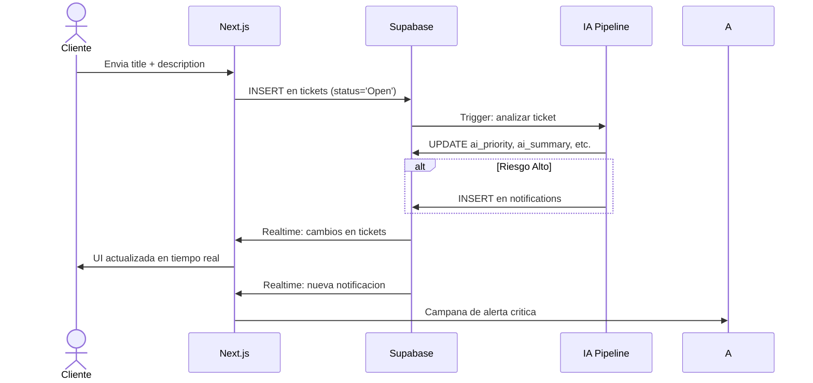
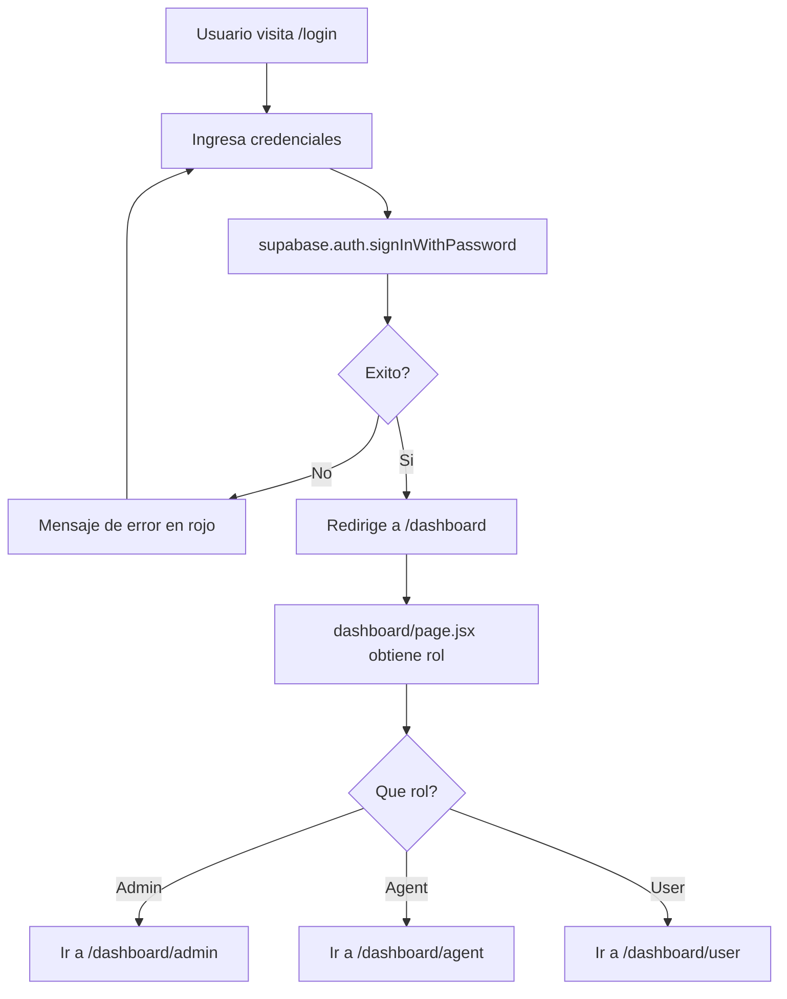
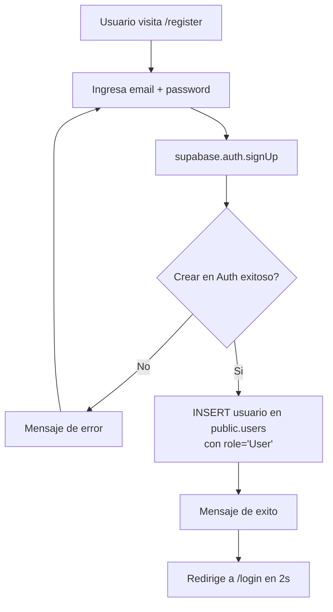

# AI Support Ticket System - Informe Tecnico

> **Version:** 1.0.0  
> **Fecha:** Junio 2026  
> **Stack:** Next.js 16 + React 19 + Supabase + Tailwind CSS 4

---

## Tabla de contenidos

1. [Resumen ejecutivo](#1-resumen-ejecutivo)
2. [Stack tecnologico](#2-stack-tecnologico)
3. [Arquitectura del sistema](#3-arquitectura-del-sistema)
4. [Estructura del proyecto](#4-estructura-del-proyecto)
5. [Descripcion de archivos de configuracion](#5-descripcion-de-archivos-de-configuracion)
6. [Paginas y enrutamiento](#6-paginas-y-enrutamiento)
7. [Componentes reutilizables](#7-componentes-reutilizables)
8. [Autenticacion y RBAC](#8-autenticacion-y-rbac)
9. [Integracion con Supabase](#9-integracion-con-supabase)
10. [Sistema de tiempo real (Realtime)](#10-sistema-de-tiempo-real-realtime)

---

## 1. Resumen ejecutivo

**AI Support Ticket System** es una aplicacion web full-stack para la gestion integral de tickets de soporte tecnico, potenciada con un motor de Inteligencia Artificial que analiza, clasifica y prioriza automaticamente cada solicitud.

La aplicacion implementa un modelo de control de acceso basado en roles (**RBAC**) con tres perfiles:

| Rol | Descripcion |
|-----|-------------|
| **User (Cliente)** | Reporta incidencias y da seguimiento a sus tickets |
| **Agent (Agente tecnico)** | Toma casos, atiende incidencias y resuelve tickets |
| **Admin (Administrador)** | Gestiona usuarios, roles y supervisa toda la operacion |

Toda la logica de backend (persistencia, autenticacion, tiempo real, IA) vive en **Supabase**, eliminando la necesidad de mantener un servidor propio.

---

## 2. Stack tecnologico

| Tecnologia | Version | Proposito |
|------------|:-------:|-----------|
| **Next.js** | 16.2.6 | Framework React con App Router, Server Components y Streaming |
| **React** | 19.2.4 | Libreria UI con Server Components y Hooks |
| **Tailwind CSS** | ^4 | Framework CSS utility-first |
| **Supabase JS** | ^2.106.1 | Cliente oficial para Auth, Postgres, Realtime y Storage |
| **@tailwindcss/postcss** | ^4 | Plugin PostCSS para Tailwind v4 |
| **ESLint** | ^9 | Linter con configuracion `eslint-config-next` |
| **PostCSS** | - | Pipeline de transformaciones CSS |

### Dependencias del proyecto (`package.json`)

```json
{
  "dependencies": {
    "@supabase/supabase-js": "^2.106.1",
    "next": "16.2.6",
    "react": "19.2.4",
    "react-dom": "19.2.4"
  },
  "devDependencies": {
    "@tailwindcss/postcss": "^4",
    "eslint": "^9",
    "eslint-config-next": "16.2.6",
    "tailwindcss": "^4"
  }
}
```

### Scripts disponibles

| Comando | Descripcion |
|---------|-------------|
| `npm run dev` | Inicia servidor de desarrollo en `localhost:3000` |
| `npm run build` | Genera build de produccion con Webpack |
| `npm run start` | Sirve la build de produccion (requiere `build` previo) |
| `npm run lint` | Ejecuta ESLint con configuracion de Next.js |

---

## 3. Arquitectura del sistema



### Flujo de datos tipico (creacion de ticket)



---

## 4. Estructura del proyecto

```
frontend/
├── public/                          # Assets estaticos (SVGs, favicon)
├── src/
│   ├── app/                         # App Router de Next.js
│   │   ├── layout.js                # Layout raiz + fuentes Geist
│   │   ├── page.js                  # Landing page (default Next.js)
│   │   ├── globals.css              # Estilos globales + tema Tailwind
│   │   ├── favicon.ico              # Icono de la aplicacion
│   │   ├── login/
│   │   │   └── page.jsx             # Inicio de sesion
│   │   ├── register/
│   │   │   └── page.jsx             # Registro de usuarios
│   │   └── dashboard/               # Rutas protegidas (RBAC)
│   │       ├── layout.jsx           # Guardian de seguridad centralizado
│   │       ├── page.jsx             # Router inteligente por rol
│   │       ├── user/                # Panel del cliente
│   │       │   ├── page.jsx         # Crear tickets + historial
│   │       │   └── [id]/page.jsx    # Detalle + chat del cliente
│   │       ├── agent/               # Mesa de operaciones
│   │       │   ├── page.jsx         # Bandeja global de tickets
│   │       │   └── [id]/page.jsx    # Detalle + chat del agente
│   │       └── admin/               # Panel de administracion
│   │           ├── page.jsx         # Panel ejecutivo completo
│   │           └── ticket/[id]/     # Detalle + chat admin
│   │               └── page.jsx
│   ├── components/                  # Componentes reutilizables
│   │   ├── AdminManagerDashboard.jsx    # Centro de metricas
│   │   ├── AgentTicketList.jsx          # Lista de tickets agente/admin
│   │   ├── TicketAgentDetail.jsx        # Detalle unificado agente/admin
│   │   ├── NotificationBell.jsx         # Alertas criticas
│   │   ├── MessageBell.jsx              # Mensajes agente
│   │   ├── UserNotificationBell.jsx     # Cambios de estado cliente
│   │   └── UserMessagesBell.jsx         # Mensajes cliente
│   └── lib/
│       └── supabase.js              # Cliente Supabase singleton
├── .env.local                       # Variables de entorno (no commiteado)
├── .gitignore                       # Reglas de ignorado
├── AGENTS.md                        # Instrucciones para agentes AI
├── CLAUDE.md                        # Referencia a AGENTS.md
├── eslint.config.mjs                # Configuracion de ESLint
├── jsconfig.json                    # Alias de import (@/*)
├── next.config.mjs                  # Configuracion de Next.js
├── package.json                     # Manifest del proyecto
├── package-lock.json                # Lock de dependencias
├── postcss.config.mjs               # Configuracion de PostCSS
├── README.md                        # Documentacion del proyecto
├── vercel.json                      # Configuracion de Vercel
└── docs/                            # Documentacion adicional
    ├── 01-INFORME-TECNICO.md
    ├── 02-BASE-DE-DATOS.md
    ├── 03-MANUAL-USUARIO.md
    ├── 04-FLUJOS-DIAGRAMAS.md
    └── 05-METODOLOGIA.md
```

---

## 5. Descripcion de archivos de configuracion

### `package.json`
Manifest del proyecto con nombre `frontend@0.1.0`. Define los scripts `dev`, `build`, `start` y `lint`. El comando `build` usa explícitamente `next build --webpack` (en lugar de Turbopack). Dependencias minimas: solo Next.js, React y Supabase JS.

### `next.config.mjs`
Configuracion minima de Next.js. Sin opciones personalizadas (vacia). Exporta el objeto `nextConfig` por defecto.

### `postcss.config.mjs`
Configura PostCSS para usar el plugin `@tailwindcss/postcss`, necesario para Tailwind CSS v4.

### `eslint.config.mjs`
Configuracion de ESLint usando `defineConfig` de `eslint/config`. Ignora `.next/`, `out/`, `build/` y `next-env.d.ts`. Usa `eslint-config-next/core-web-vitals` para reglas de Next.js.

### `jsconfig.json`
Define el alias `@/*` para importar desde `src/*`. Permite imports como `import { supabase } from '@/lib/supabase'` en lugar de rutas relativas.

### `vercel.json`
Configuracion de deploy para Vercel. Contiene solo la referencia al schema oficial.

### `.gitignore`
Ignora `node_modules/`, `.next/`, `out/`, `build/`, `.env*`, `.vercel`, `next-env.d.ts` y archivos del sistema operativo.

### `globals.css`
Estilos globales con `@import "tailwindcss"`. Define variables CSS para `--background` y `--foreground` con soporte de modo oscuro via `prefers-color-scheme: dark`. Configura las fuentes Geist Sans y Geist Mono como variables de tema.

---

## 6. Paginas y enrutamiento

La aplicacion usa el **App Router** de Next.js 16 con una combinacion de Server y Client Components.

### Mapa de rutas

| Ruta | Archivo | Tipo | Acceso | Descripcion |
|------|---------|:----:|:------:|-------------|
| `/` | `page.js` | Server | Publico | Landing page (template default) |
| `/login` | `login/page.jsx` | Client | Publico | Formulario de inicio de sesion |
| `/register` | `register/page.jsx` | Client | Publico | Formulario de registro |
| `/dashboard` | `dashboard/page.jsx` | Client | Autenticado | Router inteligente por rol |
| `/dashboard/user` | `dashboard/user/page.jsx` | Client | User | Panel del cliente |
| `/dashboard/user/[id]` | `dashboard/user/[id]/page.jsx` | Client | User | Detalle de ticket + chat |
| `/dashboard/agent` | `dashboard/agent/page.jsx` | Client | Agent, Admin | Mesa de operaciones |
| `/dashboard/agent/[id]` | `dashboard/agent/[id]/page.jsx` | Client | Agent, Admin | Detalle de ticket + chat |
| `/dashboard/admin` | `dashboard/admin/page.jsx` | Client | Admin | Panel de administracion |
| `/dashboard/admin/ticket/[id]` | `dashboard/admin/ticket/[id]/page.jsx` | Client | Admin | Detalle de ticket + chat |

### Detalle de cada pagina

#### `src/app/layout.js` (Server Component)
Layout raiz que envuelve toda la aplicacion. Carga las fuentes Geist Sans y Geist Mono de Google Fonts, aplica las variables CSS y establece la estructura basica HTML. Incluye los estilos globales via `globals.css`.

#### `src/app/page.js` (Server Component)
Pagina de aterrizaje por defecto generada por `create-next-app`. Muestra el logo de Next.js, instrucciones "To get started, edit the page.js file" y enlaces a "Templates" y "Documentation" de Vercel/Next.js.

#### `src/app/login/page.jsx` (Client Component)
Pagina de inicio de sesion con:
- Campo de correo electronico
- Campo de contrasena
- Boton de "Ingresar" con estado de carga
- Manejo de errores con mensajes en rojo
- Enlace a `/register` para usuarios sin cuenta
- Al iniciar sesion correctamente, redirige a `/dashboard`
- Usa `supabase.auth.signInWithPassword()`

#### `src/app/register/page.jsx` (Client Component)
Pagina de registro con:
- Campos de correo y contrasena
- Creacion automatica del perfil en `public.users` con rol `'User'` (cliente)
- Boton de "Registrarse" con estado de carga
- Mensaje de exito y redireccion automatica a `/login` tras 2 segundos
- Enlace de vuelta a `/login`

#### `src/app/dashboard/layout.jsx` (Client Component) - RBAC Guard
**Componente critico de seguridad.** Se ejecuta en cada navegacion dentro de `/dashboard/*`:
1. Verifica autenticacion via `supabase.auth.getUser()`
2. Obtiene el rol del usuario desde `public.users`
3. Aplica las reglas de acceso por ruta:
   - `/dashboard/admin/*` → solo Admin
   - `/dashboard/agent/*` → Agent o Admin
   - `/dashboard/user/*` → User (agentes redirigidos a su panel)
4. Muestra pantalla de carga ("Protegiendo entorno de datos...") mientras verifica

#### `src/app/dashboard/page.jsx` (Client Component) - Role Router
Pagina de entrada a `/dashboard`. Determina automaticamente el rol del usuario y redirige:
- **Admin** → `/dashboard/admin`
- **Agent** → `/dashboard/agent`
- **User** → `/dashboard/user`

#### `src/app/dashboard/user/page.jsx` (Client Component)
Panel del cliente con funcionalidad completa:
- **Formulario de creacion de tickets:** titulo + descripcion
- **Historial de tickets:** lista filtrable por estado (All/Open/In Progress/Resolved)
- **Campos IA visibles:** prioridad, analisis
- **Notificaciones:** campanas `UserNotificationBell` y `UserMessagesBell`
- **Suscripcion Realtime:** recibe actualizaciones en vivo de cambios en sus tickets
- **Boton de cerrar sesion**

#### `src/app/dashboard/user/[id]/page.jsx` (Client Component)
Detalle de ticket para el cliente:
- Informacion del ticket (titulo, descripcion, estado, prioridad)
- Chat en tiempo real con el agente de soporte
- Estados condicionales:
  - `Open`: "Esperando a que un agente tome tu caso" (chat deshabilitado)
  - `In Progress`: Chat habilitado para enviar mensajes
  - `Resolved`: Chat archivado (solo lectura)
- Dos canales Realtime: comentarios nuevos y cambios de estado

#### `src/app/dashboard/agent/page.jsx` (Client Component)
Mesa de operaciones del agente:
- **Bandeja global:** todos los tickets sin asignar
- **Mis casos:** tickets asignados al agente actual
- **Filtros por prioridad:** All / High / Medium / Low
- **Acciones:** atender (auto-asignacion) y resolver tickets
- **Campos IA visibles:** prioridad, riesgo, clasificacion, resumen, sugerencias
- **Realtime:** suscripcion a todos los cambios en `tickets`
- **Campanas:** `NotificationBell` y `MessageBell`
- Actualizacion optimista (Optimistic Update) para feedback instantaneo

#### `src/app/dashboard/agent/[id]/page.jsx` (Client Component)
Wrapper que renderiza `TicketAgentDetail` con `variant="agent"` dentro de un `Suspense` boundary.

#### `src/app/dashboard/admin/page.jsx` (Client Component) - 675 lineas
Panel de administracion mas grande de la aplicacion, con modo dual Admin/Agent:
- **Modo Admin:**
  - 4 pestanas: Resumen, Manager, Tickets, Usuarios
  - Metricas globales (total, abiertos, en progreso, resueltos, alta prioridad, usuarios)
  - Centro de metricas Manager (via componente `AdminManagerDashboard`)
  - Vista de tickets con busqueda y filtro por estado
  - Gestion de usuarios: cambio de roles, expulsion
- **Modo Agente:**
  - Interfaz operativa identica a la del agente (via `AgentTicketList`)
  - Campanas de notificacion y mensajes
- **Persistencia:** modo de vista guardado en `localStorage`
- **Realtime:** suscripcion a todos los cambios en `tickets`

#### `src/app/dashboard/admin/ticket/[id]/page.jsx` (Client Component)
Wrapper que renderiza `TicketAgentDetail` con `variant="admin"` dentro de un `Suspense` boundary.

---

## 7. Componentes reutilizables

### `TicketAgentDetail.jsx` (15.8 KB)
**Proposito:** Detalle unificado de ticket para agente y admin.
- **Props:** `variant` ('agent' | 'admin') que determina los colores (amber/purple)
- **Funciones:** carga ticket, carga comentarios, actualizar estado, enviar mensaje
- **Caracteristicas:**
  - Informacion completa del ticket (ID, titulo, descripcion, prioridad, riesgo, clasificacion, resumen IA)
  - Botones de accion contextuales ("Atender y asignarme", "Marcar como resuelto")
  - Chat en tiempo real con diferenciacion de emisor (usuario vs soporte)
  - Boton "Insertar en el chat" para usar la respuesta sugerida por IA
- **Realtime:** dos canales (comentarios INSERT, tickets UPDATE)

### `AgentTicketList.jsx` (14.1 KB)
**Proposito:** Lista reutilizable de tickets con tabs, filtros y acciones.
- **Props:** `user`, `realtimeChannelId`, `onTicketsChange`, `embedded`, `adminMode`, `userEmailById`
- **Tabs:** varian segun modo (agente: "Bandeja global"/"Mis casos"; admin: "Todos"/"Mis casos"/"En agentes")
- **Filtros:** prioridad (All/High/Medium/Low) y estado (All/Open/In Progress/Resolved)
- **Acciones:** "Abrir chat", "Atender y asignarme", "Resolver ticket"
- **Realtime:** suscripcion a cambios en `tickets`

### `AdminManagerDashboard.jsx` (17.3 KB)
**Proposito:** Centro de metricas ejecutivas para administradores.
- **Props:** `users[]`, `tickets[]`, `userEmailById{}`
- **Tabs:** "Plataforma" (global), "Por cliente", "Por agente / admin"
- **Metricas computadas:**
  - Globales: total, abiertos, en progreso, resueltos, no asignados, prioridades, horas de resolucion
  - Por cliente: tickets por estado, ultimo ticket
  - Por staff: casos asignados, resolucion, carga activa
- **Componente interno:** `MetricBar` para barras de progreso reutilizables

### `NotificationBell.jsx` (9.8 KB)
**Proposito:** Campana de alertas criticas para agentes/admin (icono rojo).
- Carga notificaciones desde Supabase con el estado del ticket asociado
- Botones: "Limpiar resueltas" (elimina notificaciones de tickets resueltos)
- **Realtime:** dos canales (notificaciones y tickets)
- Al hacer click, navega al detalle del ticket

### `MessageBell.jsx` (6.7 KB)
**Proposito:** Campana de mensajes de chat no leidos para agentes (icono azul).
- Persistencia en `localStorage`
- **Realtime:** suscripcion a INSERT en `comments`, filtra por tickets asignados
- Boton "Limpiar todo"

### `UserNotificationBell.jsx` (7.3 KB)
**Proposito:** Campana de cambios de estado de tickets para clientes (icono ambar).
- Persistencia en `localStorage`
- **Realtime:** suscripcion a UPDATE en `tickets`, filtra por `user_id`
- Muestra el nuevo estado con color codificado

### `UserMessagesBell.jsx` (7.3 KB)
**Proposito:** Campana de nuevos mensajes de chat para clientes (icono azul).
- Persistencia en `localStorage`
- **Realtime:** suscripcion a INSERT en `comments`, verifica propiedad del ticket
- Muestra preview del ultimo mensaje recibido

---

## 8. Autenticacion y RBAC

### Flujo de autenticacion



### Proceso de registro



### Matriz de permisos RBAC

| Capacidad | User | Agent | Admin |
|-----------|:----:|:-----:|:-----:|
| Registrarse y autenticarse | ✓ | ✓ | ✓ |
| Crear tickets propios | ✓ | ✓ | ✓ |
| Ver sus propios tickets | ✓ | ✓ | ✓ |
| Conversar en el chat de sus tickets | ✓ | ✓ | ✓ |
| Ver bandeja global de tickets | ✗ | ✓ | ✓ |
| Atender y auto-asignarse tickets | ✗ | ✓ | ✓ |
| Marcar ticket como `Resolved` | ✗ | ✓ | ✓ |
| Recibir alertas criticas (riesgo alto) | ✗ | ✓ | ✓ |
| Ver metricas del Manager | ✗ | ✗ | ✓ |
| Cambiar roles de otros usuarios | ✗ | ✗ | ✓ |
| Expulsar usuarios de la plataforma | ✗ | ✗ | ✓ |
| Operar como agente desde panel admin | ✗ | ✗ | ✓ |

### Guard de seguridad centralizado

El archivo `dashboard/layout.jsx` implementa un guardian de seguridad que se ejecuta en CADA navegacion dentro de `/dashboard/*`:

```
1. Obtener usuario autenticado via supabase.auth.getUser()
2. Si no autenticado → redirigir a /login
3. Obtener rol desde public.users
4. Si no hay perfil → redirigir a /login
5. Aplicar reglas de ruta:
   - /dashboard/admin/* necesita role='Admin'
   - /dashboard/agent/* necesita role='Agent' o 'Admin'
   - /dashboard/user/* solo para 'User' o 'Admin' (no Agent)
6. Si pasa todos los filtros → autorizado = true, renderizar children
```

---

## 9. Integracion con Supabase

### Cliente Supabase (`src/lib/supabase.js`)

```javascript
import { createClient } from '@supabase/supabase-js';

const supabaseUrl = process.env.NEXT_PUBLIC_SUPABASE_URL;
const supabaseAnonKey = process.env.NEXT_PUBLIC_SUPABASE_ANON_KEY;

if (!supabaseUrl || !supabaseAnonKey) {
  throw new Error('Faltan las variables de entorno de Supabase en .env.local');
}

export const supabase = createClient(supabaseUrl, supabaseAnonKey);
```

El cliente se crea como singleton en el ambito del modulo. Las variables de entorno se cargan desde `.env.local` con prefijo `NEXT_PUBLIC_` para exposicion segura al navegador.

### Uso de Supabase en la aplicacion

| Funcionalidad | Metodo Supabase | Ubicacion |
|--------------|----------------|-----------|
| Login | `supabase.auth.signInWithPassword()` | `login/page.jsx` |
| Registro | `supabase.auth.signUp()` | `register/page.jsx` |
| Obtener usuario | `supabase.auth.getUser()` | `dashboard/layout.jsx`, `dashboard/page.jsx` |
| Cerrar sesion | `supabase.auth.signOut()` | multiple paginas |
| CRUD tickets | `supabase.from('tickets').select/insert/update()` | `user/page.jsx`, `agent/page.jsx`, `admin/page.jsx` |
| CRUD comentarios | `supabase.from('comments').select/insert()` | `TicketAgentDetail.jsx`, `user/[id]/page.jsx` |
| CRUD usuarios | `supabase.from('users').select/insert/update/delete()` | `admin/page.jsx` |
| CRUD notificaciones | `supabase.from('notifications').select/delete()` | `NotificationBell.jsx` |
| Realtime tickets | `supabase.channel().on('postgres_changes', ...)` | multiples componentes |
| Realtime comentarios | `supabase.channel().on('postgres_changes', ...)` | `TicketAgentDetail.jsx`, `user/[id]/page.jsx` |

---

## 10. Sistema de tiempo real (Realtime)

La aplicacion utiliza los canales Realtime de Supabase para actualizaciones en vivo. Hay **7 suscripciones activas**:

| Componente | Tabla | Evento | Filtro |
|-----------|-------|--------|--------|
| `user/page.jsx` | `tickets` | `*` | `user_id = auth.uid()` |
| `user/[id]/page.jsx` (canal 1) | `comments` | `INSERT` | `ticket_id = [id]` |
| `user/[id]/page.jsx` (canal 2) | `tickets` | `UPDATE` | `id = [id]` |
| `agent/page.jsx` | `tickets` | `*` | Todos (sin filtro) |
| `admin/page.jsx` | `tickets` | `*` | Todos (sin filtro) |
| `AgentTicketList.jsx` | `tickets` | `*` | Todos (sin filtro) |
| `TicketAgentDetail.jsx` (canal 1) | `comments` | `INSERT` | `ticket_id = [id]` |
| `TicketAgentDetail.jsx` (canal 2) | `tickets` | `UPDATE` | `id = [id]` |
| `NotificationBell.jsx` (canal 1) | `notifications` | `*` | Todos |
| `NotificationBell.jsx` (canal 2) | `tickets` | `UPDATE` | Todos |
| `MessageBell.jsx` | `comments` | `INSERT` | `ticket_id IN [...]` |
| `UserNotificationBell.jsx` | `tickets` | `UPDATE` | `user_id = auth.uid()` |
| `UserMessagesBell.jsx` | `comments` | `INSERT` | (verifica propiedad via fetch) |

Cada suscripcion se limpia al desmontar el componente via `supabase.removeChannel()` en la funcion de retorno del `useEffect`.

---

*Documentacion generada en Junio 2026 para el proyecto AI Support Ticket System.*
