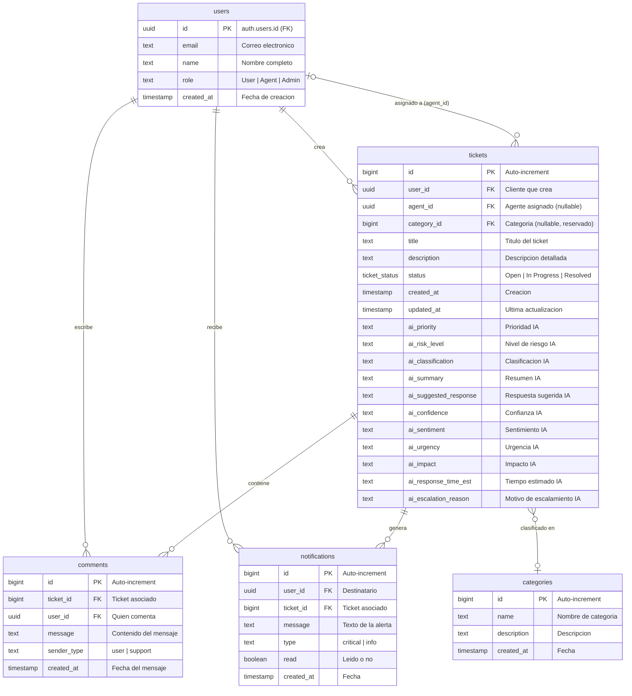
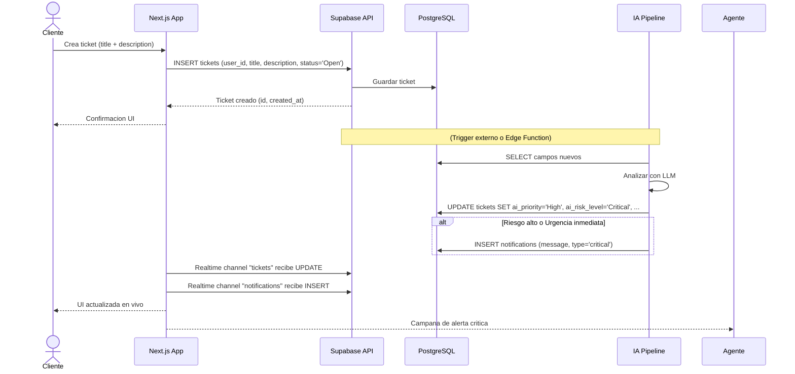

# Base de Datos - AI Support Ticket System

> **Motor:** PostgreSQL 15+ (Supabase)  
> **Esquema:** `public`  
> **Fecha:** Junio 2026

---

## Tabla de contenidos

1. [Diagrama entidad-relacion](#1-diagrama-entidad-relacion)
2. [Tablas del sistema](#2-tablas-del-sistema)
   - [Enum: ticket_status](#enum-ticket_status)
   - [public.users](#publicusers)
   - [public.tickets](#publictickets)
   - [public.comments](#publiccomments)
   - [public.notifications](#publicnotifications)
   - [public.categories](#publiccategories)
3. [Relaciones entre tablas](#3-relaciones-entre-tablas)
4. [Politicas de seguridad (RLS)](#4-politicas-de-seguridad-rls)
5. [Campos de Inteligencia Artificial](#5-campos-de-inteligencia-artificial)
6. [Flujo de datos tipico](#6-flujo-de-datos-tipico)

---

## 1. Diagrama entidad-relacion



---

## 2. Tablas del sistema

### Enum: `ticket_status`

```sql
CREATE TYPE ticket_status AS ENUM ('Open', 'In Progress', 'Resolved');
```

Controla el ciclo de vida de los tickets. Los valores permitidos son exactamente tres, sin espacios extra.

| Valor | Significado |
|-------|-------------|
| `Open` | Ticket creado, esperando asignacion |
| `In Progress` | Agente asignado, en atencion |
| `Resolved` | Solucionado, cerrado |

### `public.users`

Vincula la autenticacion de Supabase Auth con el perfil del usuario en la aplicacion.

| Columna | Tipo | Nulable | Por defecto | Descripcion |
|---------|:----:|:-------:|:-----------:|-------------|
| `id` | `uuid` | NO | - | PK. Referencia a `auth.users.id` |
| `email` | `text` | NO | - | Correo electronico unico |
| `name` | `text` | SI | - | Nombre completo |
| `role` | `text` | NO | - | `'User'`, `'Agent'` o `'Admin'` |
| `created_at` | `timestamp` | NO | `now()` | Momento de registro |

**Nota:** La tabla no tiene restriccion UNIQUE explicita en `email` porque la unicidad se maneja a nivel de Supabase Auth. Sin embargo, al insertar manualmente desde `register/page.jsx`, existe el riesgo de duplicados logicos (mejora futura sugerida).

### `public.tickets`

Tabla principal. Almacena todas las solicitudes de soporte junto con los analisis generados por IA.

| Columna | Tipo | Nulable | Por defecto | Descripcion |
|---------|:----:|:-------:|:-----------:|-------------|
| `id` | `bigint` | NO | `generated by default as identity` | PK auto-incremental |
| `user_id` | `uuid` | NO | - | FK → users.id (cliente creador) |
| `agent_id` | `uuid` | SI | - | FK → users.id (agente asignado). `NULL` = sin asignar |
| `category_id` | `bigint` | SI | - | FK → categories.id. **Reservado para uso futuro** |
| `title` | `text` | NO | - | Titulo del ticket |
| `description` | `text` | NO | - | Descripcion del problema |
| `status` | `ticket_status` | NO | `'Open'` | Estado actual del ticket |
| `created_at` | `timestamp` | NO | `now()` | Fecha de creacion |
| `updated_at` | `timestamp` | NO | `now()` | Fecha de ultima actualizacion |
| `ai_priority` | `text` | SI | - | Prioridad asignada por IA (High/Medium/Low) |
| `ai_risk_level` | `text` | SI | - | Nivel de riesgo detectado |
| `ai_classification` | `text` | SI | - | Categoria tematica (ej: "Billing", "Technical") |
| `ai_summary` | `text` | SI | - | Resumen automatico del ticket |
| `ai_suggested_response` | `text` | SI | - | Respuesta sugerida para el agente |
| `ai_confidence` | `text` | SI | - | Nivel de confianza del analisis IA |
| `ai_sentiment` | `text` | SI | - | Analisis de sentimiento del usuario |
| `ai_urgency` | `text` | SI | - | Urgencia calculada |
| `ai_impact` | `text` | SI | - | Impacto estimado |
| `ai_response_time_est` | `text` | SI | - | Tiempo de respuesta estimado |
| `ai_escalation_reason` | `text` | SI | - | Motivo de escalamiento (si aplica) |

### `public.comments`

Historial de conversacion entre el cliente y el equipo de soporte.

| Columna | Tipo | Nulable | Por defecto | Descripcion |
|---------|:----:|:-------:|:-----------:|-------------|
| `id` | `bigint` | NO | `generated by default as identity` | PK auto-incremental |
| `ticket_id` | `bigint` | NO | - | FK → tickets.id |
| `user_id` | `uuid` | NO | - | FK → users.id (autor) |
| `message` | `text` | NO | - | Contenido del mensaje |
| `sender_type` | `text` | NO | - | `'user'` o `'support'` |
| `created_at` | `timestamp` | NO | `now()` | Fecha del mensaje |

### `public.notifications`

Alertas generadas automaticamente para agentes y usuarios.

| Columna | Tipo | Nulable | Por defecto | Descripcion |
|---------|:----:|:-------:|:-----------:|-------------|
| `id` | `bigint` | NO | `generated by default as identity` | PK auto-incremental |
| `user_id` | `uuid` | NO | - | FK → users.id (destinatario) |
| `ticket_id` | `bigint` | NO | - | FK → tickets.id |
| `message` | `text` | NO | - | Texto de la notificacion |
| `type` | `text` | NO | - | `'critical'` o `'info'` |
| `read` | `boolean` | NO | `false` | Estado de lectura |
| `created_at` | `timestamp` | NO | `now()` | Fecha de emision |

### `public.categories`

**Reservada para uso futuro.** Permitira clasificar tickets por categoria predefinida.

| Columna | Tipo | Nulable | Por defecto | Descripcion |
|---------|:----:|:-------:|:-----------:|-------------|
| `id` | `bigint` | NO | `generated by default as identity` | PK auto-incremental |
| `name` | `text` | NO | - | Nombre de la categoria |
| `description` | `text` | SI | - | Descripcion opcional |
| `created_at` | `timestamp` | NO | `now()` | Fecha de creacion |

---

## 3. Relaciones entre tablas

### Resumen de Llaves Foraneas

| Columna FK | Tabla origen | Tabla destino | Nulable | Descripcion |
|------------|-------------|---------------|:-------:|-------------|
| `users.id` | `users` | `auth.users` | NO | Identidad del usuario |
| `tickets.user_id` | `tickets` | `users` | NO | Cliente dueno del ticket |
| `tickets.agent_id` | `tickets` | `users` | SI | Agente asignado (NULL = sin asignar) |
| `tickets.category_id` | `tickets` | `categories` | SI | Categoria (NULL = sin clasificar) |
| `comments.ticket_id` | `comments` | `tickets` | NO | Ticket al que pertenece el mensaje |
| `comments.user_id` | `comments` | `users` | NO | Autor del mensaje |
| `notifications.user_id` | `notifications` | `users` | NO | Destinatario de la alerta |
| `notifications.ticket_id` | `notifications` | `tickets` | NO | Ticket relacionado a la alerta |

### Cardinalidad

```
  users (1) ──< tickets (N)      Un usuario puede crear muchos tickets
  users (1) ──< comments (N)     Un usuario puede escribir muchos comentarios
  users (1) ──< notifications (N) Un usuario puede recibir muchas notificaciones
  tickets (1) ──< comments (N)    Un ticket puede tener muchos comentarios
  tickets (1) ──< notifications (N) Un ticket puede generar muchas notificaciones
  tickets (N) >── (1) users      Un ticket puede tener un agente asignado (NULL si no)
  tickets (N) >── (1) categories  Un ticket puede pertenecer a una categoria (NULL si no)
```

---

## 4. Politicas de seguridad (RLS)

Supabase Row Level Security (RLS) esta habilitado en todas las tablas. A continuacion, las politicas implementadas:

### `public.users`

| Politica | Operacion | Condicion |
|----------|:---------:|-----------|
| Insert propio | `INSERT` | `auth.uid() = id` (solo el usuario puede crear SU perfil) |
| Leer propio | `SELECT` | `auth.uid() = id` (solo puede ver su propio perfil) |
| Actualizar propio | `UPDATE` | `auth.uid() = id` (solo puede modificar su perfil) |
| Insert admin | `INSERT` | `auth.uid() IN (SELECT id FROM users WHERE role = 'Admin')` |
| Leer admin | `SELECT` | `auth.uid() IN (SELECT id FROM users WHERE role = 'Admin')` |
| Actualizar admin | `UPDATE` | `auth.uid() IN (SELECT id FROM users WHERE role = 'Admin')` |
| Eliminar admin | `DELETE` | `auth.uid() IN (SELECT id FROM users WHERE role = 'Admin')` |

### `public.tickets`

| Politica | Operacion | Condicion |
|----------|:---------:|-----------|
| Insert propio | `INSERT` | `auth.uid() = user_id` |
| Ver propios | `SELECT` | `auth.uid() = user_id` |
| Ver staff | `SELECT` | `auth.uid() IN (SELECT id FROM users WHERE role IN ('Agent', 'Admin'))` |
| Actualizar propio | `UPDATE` | `auth.uid() = user_id` |
| Actualizar staff | `UPDATE` | `auth.uid() IN (SELECT id FROM users WHERE role IN ('Agent', 'Admin'))` |

### `public.comments`

| Politica | Operacion | Condicion |
|----------|:---------:|-----------|
| Insert propio | `INSERT` | `auth.uid() = user_id` |
| Leer propios | `SELECT` | `auth.uid() = user_id` |
| Leer staff | `SELECT` | `auth.uid() IN (SELECT id FROM users WHERE role IN ('Agent', 'Admin'))` |
| Leer clientes | `SELECT` | `auth.uid() IN (SELECT t.user_id FROM tickets t WHERE t.id = comments.ticket_id)` |

### `public.notifications`

| Politica | Operacion | Condicion |
|----------|:---------:|-----------|
| Leer propias | `SELECT` | `auth.uid() = user_id` |
| Eliminar propias | `DELETE` | `auth.uid() = user_id` |

### `public.categories`

| Politica | Operacion | Condicion |
|----------|:---------:|-----------|
| Leer todos | `SELECT` | `true` (acceso publico de lectura) |
| Gestionar admin | `INSERT, UPDATE, DELETE` | `auth.uid() IN (SELECT id FROM users WHERE role = 'Admin')` |

---

## 5. Campos de Inteligencia Artificial

La tabla `tickets` contiene **11 campos especificos** para los resultados del pipeline de IA. El sistema utiliza una caja negra (black box) donde la aplicacion frontend solo interactua con las entradas y salidas del analisis:

### Entradas del sistema IA

| Campo de entrada | Fuente |
|------------------|--------|
| `title` | Texto escrito por el usuario |
| `description` | Texto escrito por el usuario |

### Salidas del sistema IA (actualizados por un proceso externo)

| Campo | Tipo | Valores tipicos | Proposito |
|-------|:----:|-----------------|-----------|
| `ai_priority` | `text` | `"High"`, `"Medium"`, `"Low"` | Priorizar cola de atencion |
| `ai_risk_level` | `text` | `"Critical"`, `"High"`, `"Medium"`, `"Low"` | Identificar urgencias de seguridad |
| `ai_classification` | `text` | Ej: `"Technical Support"`, `"Billing"` | Categorizar el tipo de problema |
| `ai_summary` | `text` | Resumen de 1-2 oraciones | Vista rapida del ticket |
| `ai_suggested_response` | `text` | Borrador de respuesta | Acelerar la respuesta del agente |
| `ai_confidence` | `text` | `"High"`, `"Medium"`, `"Low"` | Que tan seguro es el analisis |
| `ai_sentiment` | `text` | `"Positive"`, `"Neutral"`, `"Negative"`, `"Urgent"` | Estado emocional del usuario |
| `ai_urgency` | `text` | `"Immediate"`, `"High"`, `"Medium"`, `"Low"` | Nivel de urgencia |
| `ai_impact` | `text` | `"Critical"`, `"Major"`, `"Minor"` | Impacto del incidente |
| `ai_response_time_est` | `text` | Ej: `"~15 minutes"`, `"~2 hours"` | Tiempo estimado de respuesta |
| `ai_escalation_reason` | `text` | `NULL` o motivo de escalamiento | Indica si debe escalarse |

El motor de IA se ejecuta externamente (probablemente via Supabase Edge Functions o un webhook) y actualiza estos campos via `UPDATE` directo a la tabla `tickets`. El frontend jamas invoca el modelo de lenguaje directamente; solo lee los campos `ai_*` poblados.

---

## 6. Flujo de datos tipico



---

*Documentacion generada en Junio 2026 para el proyecto AI Support Ticket System.*
