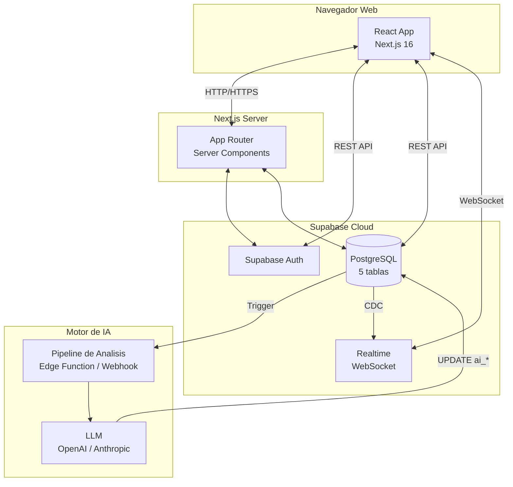
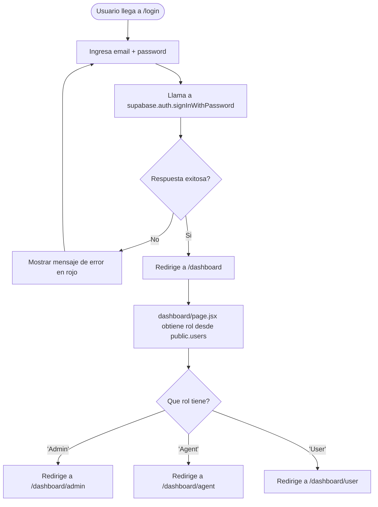
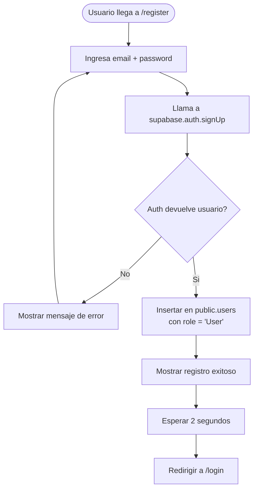
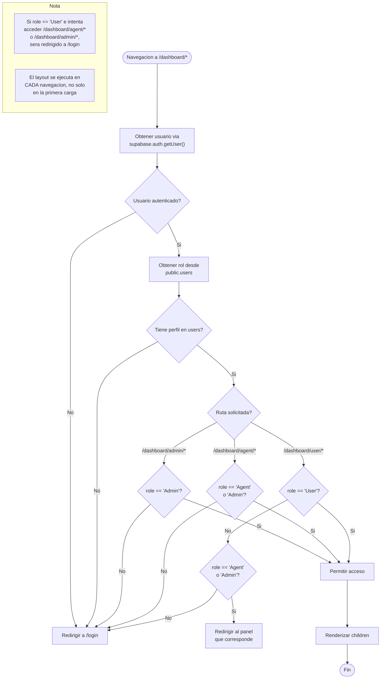
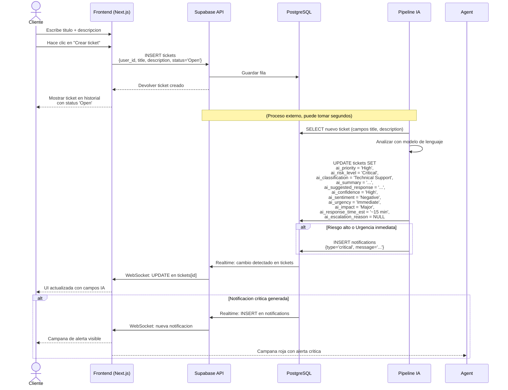
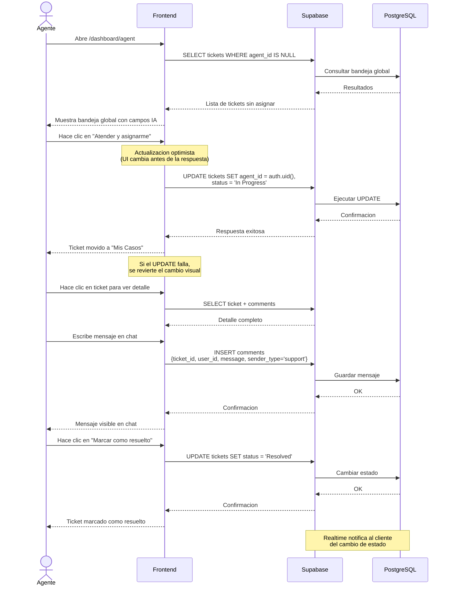
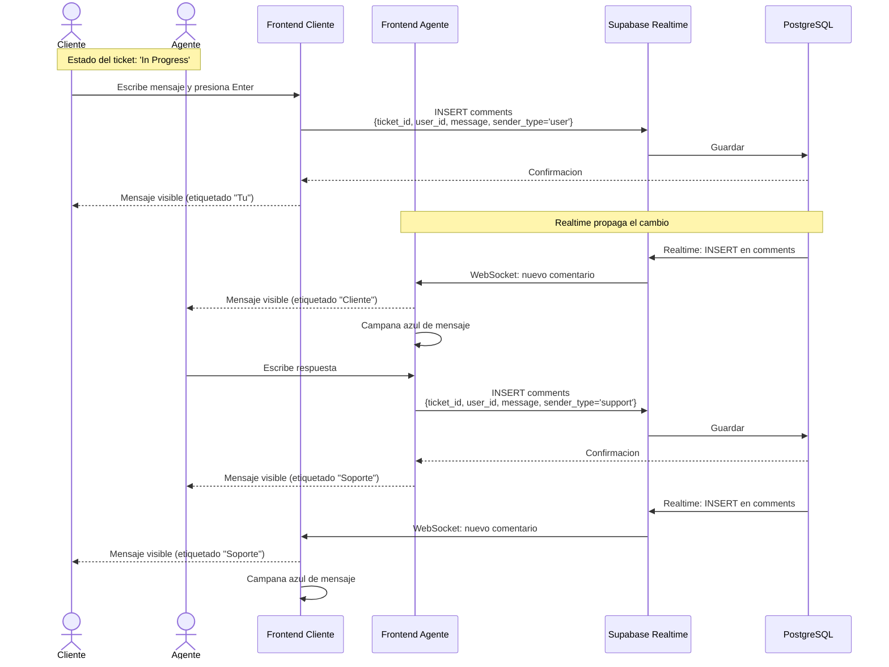
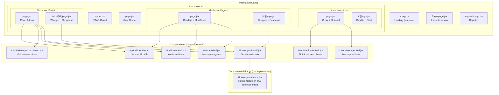
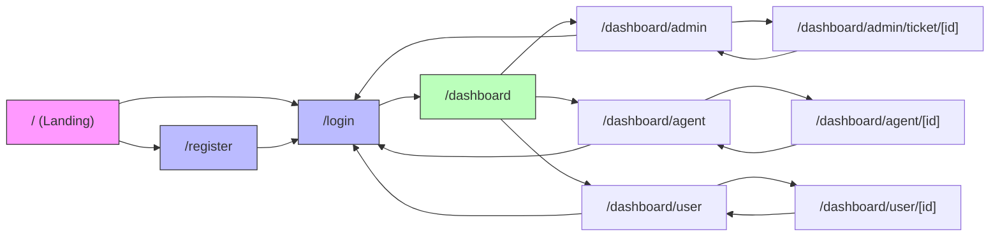
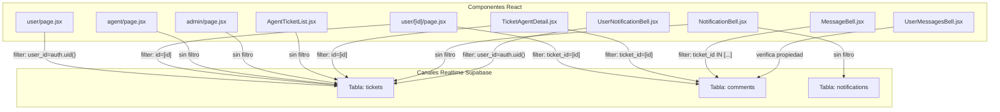

# Diagramas de Flujo - AI Support Ticket System

> **Nota:** Todos los diagramas usan sintaxis Mermaid.js y son renderizados nativamente por GitHub.

---

## 1. Arquitectura del sistema

---

## 2. Flujo de autenticacion

---

## 3. Flujo de registro

---

## 4. Flujo de seguridad RBAC (Guard centralizado)

---

## 5. Flujo creacion de ticket + analisis IA

---

## 6. Flujo de atencion del agente

---

## 7. Flujo de chat en tiempo real

---

## 8. Diagrama de componentes

---

## 9. Diagrama de navegacion

---

## 10. Matriz de permisos RBAC

| # | Capacidad | User | Agent | Admin |
|:-:|-----------|:----:|:-----:|:-----:|
| 1 | Crear tickets | ✓ | ✓ | ✓ |
| 2 | Ver tickets propios | ✓ | ✓ | ✓ |
| 3 | Chatear en tickets propios | ✓ | ✓ | ✓ |
| 4 | Ver todos los tickets | ✗ | ✓ | ✓ |
| 5 | Atender / asignarse tickets | ✗ | ✓ | ✓ |
| 6 | Resolver tickets | ✗ | ✓ | ✓ |
| 7 | Ver metricas globales | ✗ | ✗ | ✓ |
| 8 | Gestionar roles de usuarios | ✗ | ✗ | ✓ |
| 9 | Expulsar usuarios | ✗ | ✗ | ✓ |

> **Leyenda:** ✓ = Permitido | ✗ = Denegado

---

## 11. Suscripciones Realtime

---

*Documentacion generada en Junio 2026 para el proyecto AI Support Ticket System.*
