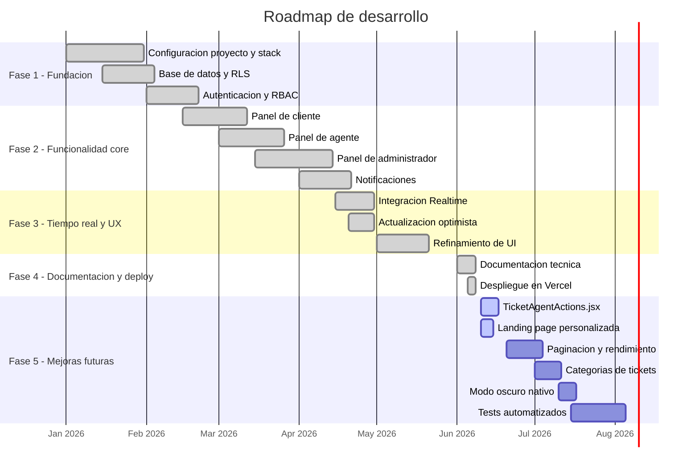

# Metodologia de Desarrollo - AI Support Ticket System

> **Version:** 1.0.0  
> **Fecha:** Junio 2026

---

## Tabla de contenidos

1. [Enfoque de desarrollo](#1-enfoque-de-desarrollo)
2. [Stack tecnologico y justificacion](#2-stack-tecnologico-y-justificacion)
3. [Estructura del proyecto](#3-estructura-del-proyecto)
4. [Proceso de desarrollo](#4-proceso-de-desarrollo)
5. [Seguridad y control de acceso](#5-seguridad-y-control-de-acceso)
6. [Manejo de estado y tiempo real](#6-manejo-de-estado-y-tiempo-real)
7. [Decisiones tecnicas clave](#7-decisiones-tecnicas-clave)
8. [Funcionalidades pendientes o por implementar](#8-funcionalidades-pendientes-o-por-implementar)
9. [Roadmap sugerido](#9-roadmap-sugerido)

---

## 1. Enfoque de desarrollo

El proyecto fue desarrollado siguiendo los principios de **desarrollo rapido con plataformas backend-as-a-service (BaaS)**, minimizando la infraestructura propia y maximizando el uso de servicios gestionados.

### Principios rectores

| Principio | Aplicacion |
|-----------|------------|
| **Serverless first** | Sin servidores propios. Supabase maneja autenticacion, base de datos, tiempo real y potencialmente Edge Functions |
| **Componentes reutilizables** | La logica compartida entre roles (Admin/Agent) se extrajo a componentes comunes (`TicketAgentDetail`, `AgentTicketList`) |
| **Actualizacion optimista** | Las UI de agentes actualizan el estado antes de recibir confirmacion del servidor, mejorando la percepcion de velocidad |
| **Seguridad por capas** | RLS en base de datos + guardian de rutas en frontend + separacion de roles |
| **Tiempo real nativo** | Aprovechamiento de los WebSocket de Supabase Realtime para sincronizacion sin polling |

---

## 2. Stack tecnologico y justificacion

| Tecnologia | Por que fue elegida |
|------------|---------------------|
| **Next.js 16** | Framework React con Server Components, App Router y streaming. Permite construir aplicaciones full-stack con un solo proyecto |
| **React 19** | Ultima version estable con Server Components, mejoras en hooks y concurrencia |
| **Supabase** | Alternativa open-source a Firebase. Proporciona Postgres, Auth, Realtime y Edge Functions en un solo producto |
| **Tailwind CSS 4** | Utility-first CSS con configuracion minima. La version 4 elimina la necesidad de `tailwind.config.js` |
| **PostgreSQL** | Base de datos relacional madura con soporte de tipos enum, RLS, y funciones avanzadas |

### Por que NO se usaron

| Tecnologia | Motivo |
|------------|--------|
| **API Routes de Next.js** | Supabase RLS permite operaciones directas desde el cliente sin necesidad de una capa API intermedia |
| **Zustand / Redux** | El estado de la aplicacion es mayormente local a cada componente o se sincroniza via Realtime |
| **tRPC / GraphQL** | La complejidad no lo justifica. Las consultas son mayormente CRUD directo a Supabase |
| **Prisma / Drizzle** | Supabase incluye su propio cliente SQL y ORM ligero. No se requiere otro ORM |

---

## 3. Estructura del proyecto

### Patron de organizacion

```
src/
├── app/                    # App Router (paginas y layouts)
│   ├── layout.js           # Layout raiz (Server Component)
│   ├── page.js             # Landing page
│   ├── login/
│   ├── register/
│   └── dashboard/          # Rutas protegidas
│       ├── layout.jsx      # RBAC Guard (Client Component)
│       ├── page.jsx        # Role Router (Client Component)
│       ├── user/
│       ├── agent/
│       └── admin/
├── components/             # Componentes reutilizables
└── lib/                    # Logica compartida (cliente Supabase)
```

### Convenciones

- Archivos `.jsx` para componentes con JSX, `.js` para paginas sin JSX (Server Components simples) y configuraciones
- Alias `@/` para importar desde `src/` (configurado en `jsconfig.json`)
- Nombres en PascalCase para componentes (`NotificationBell.jsx`)
- Nombres en kebab-case para rutas (`ticket/[id]/page.jsx`)

---

## 4. Proceso de desarrollo

### Fase 1: Configuracion del proyecto

1. Creacion del proyecto con `create-next-app`
2. Instalacion de dependencias: `@supabase/supabase-js`, `tailwindcss`, `@tailwindcss/postcss`
3. Configuracion de PostCSS y Tailwind v4
4. Creacion del cliente Supabase singleton en `src/lib/supabase.js`
5. Configuracion de variables de entorno para URL y anon key de Supabase

### Fase 2: Base de datos y autenticacion

1. Diseno del esquema PostgreSQL con 5 tablas
2. Creacion del enum `ticket_status`
3. Configuracion de RLS para todas las tablas
4. Implementacion de autenticacion (login + registro)
5. Creacion del trigger de perfil (insercion automatica en `users` tras registro)

### Fase 3: Panel de cliente

1. Pagina de dashboard con router por rol
2. Formulario de creacion de tickets
3. Lista de tickets del cliente con filtros
4. Detalle de ticket con chat en tiempo real

### Fase 4: Panel de agente

1. Bandeja global de tickets sin asignar
2. Accion de "Atender y asignarme"
3. Pestana "Mis Casos"
4. Filtros por prioridad y estado
5. Resolucion de tickets
6. Chat en tiempo real con cliente

### Fase 5: Panel de administrador

1. Panel ejecutivo con metricas globales (`AdminManagerDashboard`)
2. Centro de metricas avanzadas (Manager)
3. Gestion de usuarios (cambio de roles, expulsion)
4. Modo agente alternable
5. Componente `AgentTicketList` reutilizable

### Fase 6: Sistema de notificaciones

1. Notificaciones criticas para agentes (`NotificationBell`)
2. Notificaciones de mensajes para agentes (`MessageBell`)
3. Notificaciones de estado para clientes (`UserNotificationBell`)
4. Notificaciones de mensajes para clientes (`UserMessagesBell`)

### Fase 7: Tiempo real

1. Integracion de canales Realtime de Supabase
2. Sincronizacion de cambios en tickets y comentarios
3. Subscripciones filtradas por usuario y ticket

### Fase 8: Despliegue

1. Configuracion en Vercel
2. Variables de entorno en Vercel
3. Build con `next build --webpack`

---

## 5. Seguridad y control de acceso

### Estrategia de seguridad multicapa

```
Capa 1: Supabase Auth
  └── Autenticacion via email/password con JWT

Capa 2: Row Level Security (RLS)
  └── Politicas a nivel de fila en PostgreSQL
  └── Cada tabla tiene politicas especificas por rol
  └── Verificacion de auth.uid() en cada operacion

Capa 3: RBAC en frontend
  └── dashboard/layout.jsx bloquea rutas no autorizadas
  └── dashboard/page.jsx redirige al panel correcto segun rol

Capa 4: Cliente Supabase con anon key
  └── La anon key tiene RLS como unica proteccion
  └── Sin service_role key expuesta al frontend
```

### Principio de minimo privilegio

Cada usuario ve y modifica solo los datos que necesita:

- **Clientes:** solo sus tickets, solo sus comentarios, solo sus notificaciones
- **Agentes:** todos los tickets (para asignarse), solo los comentarios de tickets que pueden ver
- **Administradores:** todo (lectura y escritura completa)

---

## 6. Manejo de estado y tiempo real

### Sin estado global

El proyecto NO utiliza bibliotecas de estado global (Zustand, Redux, Jotai, etc.). El estado se maneja de forma:

1. **Local a cada componente:** `useState` para formularios, filtros, modales
2. **Sincronizado via Realtime:** los cambios en la base de datos se propagan automaticamente
3. **Persistido en localStorage:** modo de vista del admin, notificaciones leidas

### Estrategia de subscripciones Realtime

Cada componente que necesita actualizaciones en vivo abre su propio canal. Los canales se cierran al desmontar el componente (cleanup en `useEffect`). No hay un sistema centralizado de subscripciones, lo que permite que cada componente sea autocontenido.

### Actualizacion optimista

En el panel de agente, cuando un agente hace clic en "Atender y asignarme", la UI se actualiza inmediatamente (el ticket se mueve a "Mis Casos") antes de recibir confirmacion del servidor. Si la operacion falla, el cambio se revierte.

---

## 7. Decisiones tecnicas clave

### 7.1. Componente TicketAgentDetail unificado

**Decision:** Un solo componente `TicketAgentDetail.jsx` con prop `variant` ('agent' | 'admin') que renderiza ambos roles.

**Motivo:** La logica de detalle de ticket es identica para agente y admin (ver info, chatear, cambiar estado). Solo cambian los colores (amber para agente, purple para admin). Evita duplicacion de codigo.

### 7.2. AgentTicketList reutilizable

**Decision:** `AgentTicketList.jsx` acepta `adminMode` para personalizar el comportamiento.

**Motivo:** Tanto el panel de agente como el modo agente del admin necesitan la misma lista de tickets con tabs y filtros.

### 7.3. Sin middleware.js

**Decision:** No se implemento archivo `middleware.js` para proteccion de rutas.

**Motivo:** La proteccion se maneja via el layout de dashboard (Client Component) que verifica autenticacion y rol en cada navegacion. Esto permite mostrar estados de carga personalizados ("Protegiendo entorno de datos...") y evita la complejidad de un middleware.

### 7.4. Server Components vs Client Components

**Decision:** Uso mixto:
- `page.js` y `layout.js` raiz: Server Components (no necesitan interactividad)
- Todas las paginas de dashboard y componentes: Client Components (necesitan hooks, estado, Realtime)

**Motivo:** El App Router de Next.js 16 permite esta combinacion naturalmente.

### 7.5. Suspense boundaries

**Decision:** Las rutas de detalle de agente/admin envuelven `TicketAgentDetail` en un `Suspense` boundary.

**Motivo:** `TicketAgentDetail` usa `useSearchParams()` que requiere Suspense en Next.js 16. La ruta de usuario (`user/[id]/page.jsx`) no lo necesita porque usa `useParams()` directamente.

### 7.6. Build con Webpack

**Decision:** El script `build` usa `next build --webpack` en lugar de Turbopack.

**Motivo:** Esta fue la configuracion generada por `create-next-app` en la version utilizada. Asegura compatibilidad total.

### 7.7. Pipeline IA como caja negra

**Decision:** El analisis de IA se modela como un proceso externo que lee y escribe en la base de datos. El frontend solo consume los campos `ai_*` resultantes.

**Motivo:** Separa la preocupacion del analisis IA de la aplicacion frontend. Permite cambiar de proveedor de IA (OpenAI, Anthropic, Claude, etc.) sin modificar el codigo del frontend.

---

## 8. Funcionalidades pendientes o por implementar

### Criticas

| Funcionalidad | Ubicacion | Estado |
|--------------|-----------|--------|
| **TicketAgentActions.jsx** | `src/components/` | **NO EXISTE** - Referenciado en `TicketAgentDetail.jsx` como componente de acciones contextuales. Sin este archivo, las acciones de agente/admin (cambiar estado, asignar) en la vista de detalle pueden no funcionar |
| **Pagina de landing personalizada** | `src/app/page.js` | Template scaffold de `create-next-app`. Muestra "To get started, edit the page.js file" |
| **Layout raiz personalizado** | `src/app/layout.js` | Template scaffold de `create-next-app`. Tiene estructura generica |

### Mejoras futuras sugeridas

| Funcionalidad | Prioridad | Descripcion |
|--------------|:---------:|-------------|
| Implementar categorias de tickets | Media | La tabla `categories` existe pero no se usa. Permitiria clasificar tickets por area |
| Restriccion UNIQUE en email de users | Media | La tabla `users` no tiene UNIQUE en email, lo que permite duplicados logicos |
| Pagina de bienvenida / onboarding | Baja | Guia para nuevos usuarios sobre como usar la plataforma |
| Componente de carga global (Skeleton) | Baja | Estado de carga visual para mejorar UX mientras se obtienen datos |
| Modo oscuro nativo | Baja | El CSS ya define variables para preferencia oscura, pero no se implemento el toggle |
| Paginacion en listas de tickets | Baja | Las listas actualmente cargan todos los tickets sin paginacion |
| Breadcrumbs de navegacion | Baja | Migas de pan para orientar al usuario en la navegacion |
| version movil responsiva | Media | Verificar y ajustar layouts para pantallas pequeñas |

---

## 9. Roadmap sugerido



---

*Documentacion generada en Junio 2026 para el proyecto AI Support Ticket System.*
